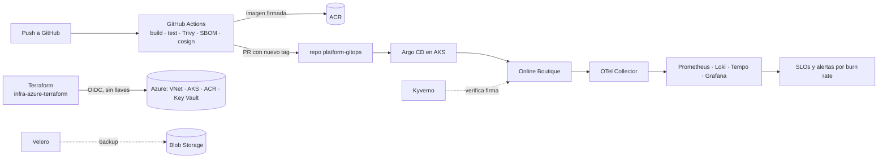

# devops-sre-lab

Laboratorio y portafolio de **DevOps / SRE en la nube**. Se toma un sistema
real de microservicios y se le construye encima, paso a paso, todo lo que
un equipo de plataforma necesita para operarlo en producción: infraestructura
como código, CI/CD, GitOps, observabilidad, SLOs, caos, seguridad,
recuperación ante desastres y costos.

Esta carpeta es el **repositorio hub**: aquí van el plan, las decisiones
(ADRs) y las convenciones. Cada proyecto (P0…P8) es **su propio repositorio**
en GitHub (están en `.gitignore` de este hub).

## Sistema base

| Sistema | Para qué se usa | Por qué |
|---|---|---|
| [Online Boutique](https://github.com/GoogleCloudPlatform/microservices-demo) (Google) | Sistema principal (P0–P4, P6–P8) | 11 microservicios gRPC en Go, Python, Java, C# y Node; trae generador de carga; corre en ~3 GB de RAM, cabe en local |
| [OpenTelemetry Demo](https://github.com/open-telemetry/opentelemetry-demo) (Astronomy Shop) | Laboratorio SRE (P5) | Ya viene instrumentado con OpenTelemetry y trae **fallas activables por feature flags** (flagd): ideal para simular incidentes. Pesa más (~6 GB), así que se corre en la nube |

Ver [ADR-0001](docs/adr/0001-sistema-base.md) y [ADR-0002](docs/adr/0002-nube-principal.md).

## Proyectos

| # | Repo | Tema | Estado |
|---|---|---|---|
| P0 | [`local-k8s-lab`](https://github.com/miguelortiz13/local-k8s-lab) | Entorno local reproducible (kind, Makefile, Online Boutique) | ✅ |
| P1 | [`infra-azure-terraform`](https://github.com/miguelortiz13/infra-azure-terraform) | IaC: AKS, ACR, VNet, Key Vault con Terraform + pipeline | ✅ |
| P2 | `online-boutique-ci` | CI de imágenes: build, escaneo, SBOM, firma, push | ⬜ |
| P3 | `platform-gitops` | Argo CD, Kustomize, Gateway API, secretos, canary | ⬜ |
| P4 | `observability-stack` | Prometheus, Grafana, Loki, Tempo, OpenTelemetry | ⬜ |
| P5 | `sre-reliability-lab` | SLOs, error budgets, k6, Chaos Mesh, runbooks, postmortems | ⬜ |
| P6 | `k8s-security-policies` | Kyverno, NetworkPolicies, Falco, Workload Identity | ⬜ |
| P7 | `dr-finops` | Velero, simulacro de DR (RTO/RPO), autoscaling, OpenCost | ⬜ |
| P8 | `infra-aws-terraform` | Portabilidad: la misma plataforma en AWS EKS | ⬜ |

Estados: ⬜ pendiente · 🟨 en curso · ✅ terminado.

## Backlog: épicas y tareas

El trabajo está organizado en **[issues de este repo](https://github.com/miguelortiz13/devops-sre-lab/issues)**:

- **Épica** (`tipo:épica`): una por proyecto, con objetivo y criterio de terminado.
- **Tarea** (`tipo:tarea`): sub-issue de su épica, con *por qué*, conceptos, paso a paso con checkboxes y criterios de aceptación. Las que tienen `hazlo-tú` son para ejecutarlas tú.
- **Milestones**: las 4 fases del roadmap.

El backlog es código: vive en [`backlog/`](backlog/) (un YAML por épica) y se
publica con `scripts/sync_backlog.py` (idempotente; `--dry-run` para ver qué
haría). Para agregar o cambiar tareas se edita el YAML y se vuelve a ejecutar.

El plan detallado (orden, entregables, criterios de terminado) está en
[ROADMAP.md](ROADMAP.md). Las reglas comunes a todos los repos están en
[docs/convenciones.md](docs/convenciones.md).

## Arquitectura objetivo

